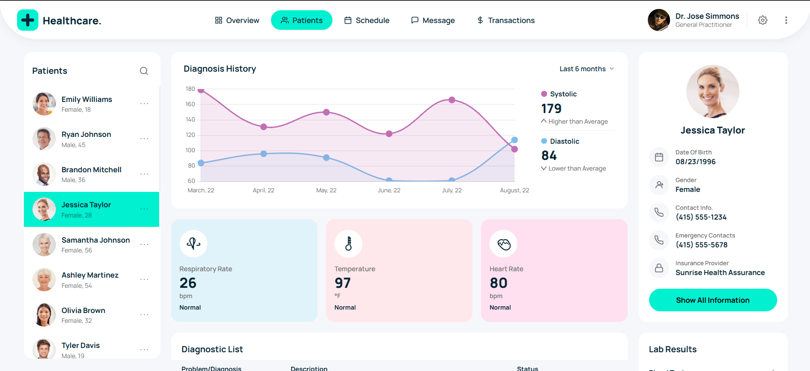

🏥 Healthcare Patient Dashboard

A modern and responsive Patient Management Dashboard UI designed to visualize patient data, diagnosis history, and health metrics in a clean and user-friendly interface.

✨ Overview

This project demonstrates a real-world healthcare dashboard where users can:

View a list of patients
Analyze diagnosis history through charts
Monitor vital health metrics
Access detailed patient information

The UI is designed with a focus on clarity, usability, and modern design principles.

🚀 Features

✔️ Interactive patient list
✔️ Diagnosis history visualization
✔️ Health metrics (Heart Rate, Temperature, etc.)
✔️ Clean dashboard layout
✔️ Responsive design
✔️ Minimal and modern UI

🛠️ Tech Stack
HTML5 – Structure
CSS3 – Styling & Layout
JavaScript (Vanilla JS) – Functionality
📸 Preview

📂 Project Structure
Patient/
│── index.html  
│── style.css  
│── script.js  
│── assets/  
│   └── screenshot.png  
⚙️ Getting Started
1. Clone the repository
git clone https://github.com/your-username/HealthCare.git
2. Navigate to project folder
cd HealthCare
3. Run the project

Open index.html in your browser

🎯 Future Improvements
Add backend integration (Node.js / Express)
Connect with database (MongoDB)
Authentication system
Real-time patient data updates

